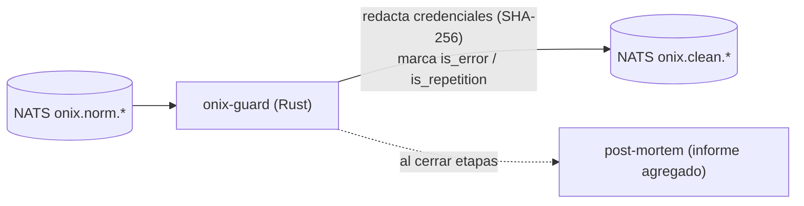

# onix-guard

Servicio de **seguridad + análisis** de OnixGuard. Escrito en **Rust**. Es el único servicio que ve el valor crudo de las credenciales, y lo **destruye**: redacta secretos (SHA-256), marca repeticiones e ineficiencias, y genera el post-mortem al cerrar etapas.

> **Estado (Fase 2 ✅):** implementado en Rust (async-nats + tokio). Consume `onix.norm.*`, **redacta credenciales** (SHA-256, fail-closed), **detecta** error (`exit_code!=0`) y repetición (`tool`+`params_hash` ≥3 en ventana 4 min), y publica `onix.clean.*` sin el valor real. Expone `/healthz`. Con tests unitarios de redacción y detección.

## Estructura
```text
src/main.rs     # loop async-nats JetStream (norm→clean) + servidor de salud
src/types.rs    # NormEvent (entra) / CleanEvent (sale) / Credential
src/redact.rs   # redacción por nombre de campo y por patrón + params_hash (con tests)
src/detect.rs   # is_error + RepetitionDetector con ventana (con tests)
Dockerfile      # multi-stage (rust:1-bookworm → distroless/cc)
```

## Correr y probar
```bash
cargo test                 # tests de redacción (nunca filtra el valor) y detección
cargo run                  # NATS_URL=nats://localhost:4222 por defecto
```
En el conjunto: `make e2e` desde onix-deploy lo levanta junto al pipeline.

## Reglas de redacción (resumen)
- **Por nombre de campo (fail-closed):** `password`, `token`, `secret`, `api_key`, `dsn`, … → redacta el valor completo.
- **Por patrón de valor:** cadenas de conexión con usuario:clave@host, API keys (`sk-`, `sk-ant-`, `AKIA…`, `ghp_…`, `AIza…`, `xox…`), JWT, y asignaciones `VAR_SECRET=valor` en contenido `.env`.
- Reemplaza el valor por `[credencial · sha256:…]` y guarda **solo** el hash + tipo. El valor real nunca sale del proceso.

---

## Responsabilidad



Entrada `NormEvent` (`onix.norm.*`) → Salida `CleanEvent` (`onix.clean.*`), ya **sin valores de credenciales**.

## Qué hará

- **Redacción de secretos (fail-closed):** detecta API keys, tokens, contraseñas, cadenas de conexión y contenido de `.env`; reemplaza el valor por `[credencial · sha256:…]` + tipo. El valor real **nunca** se publica en `clean`, ni se guarda, ni se loguea. Ante la duda, redacta.
- **Detección** (umbrales configurables):
  - **Error:** tool falla o `exit_code != 0`.
  - **Repetición:** mismo `tool` + `params_hash` ≥ 3 veces en ventana de 4 min.
  - **Ineficiencia:** reintentos sin cambios, relectura de archivos grandes, tokens de etapa > 1.5× la mediana, etc.
- **Post-mortem:** informe agregado por etapa/agente (costo, tiempo, errores, cuellos de botella) para el estudio multiagente.

## Por qué Rust

Es el servicio crítico de seguridad (maneja el valor crudo de secretos) y de análisis intensivo. Rust da garantías de memoria y rendimiento para esa responsabilidad.

## Contratos

- **Consume:** `NormEvent` (`onix.norm.*`).
- **Produce:** `CleanEvent` (`onix.clean.*`) → lo consumen `onix-recorder` y `onix-gateway`.
- **Importa:** crate `onix-contracts` (ver ese repo).

## Estructura (futura)

```text
src/            # lógica de redacción, detección, post-mortem
Cargo.toml
Dockerfile      # multi-stage (rust → imagen mínima)
```

## Pruebas clave (QA)

Unit tests de **redacción** (que jamás filtre el valor) y de **detección** con casos límite. Es la red de seguridad más importante del sistema.

---

*Parte de OnixGuard. Ver el plan en `OnixGuard/docs/PLAN.md` §1, §8 (detección) y §9 (seguridad).*
